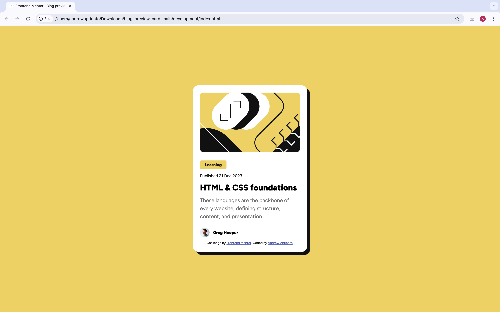

# Frontend Mentor - Blog preview card solution

This is a solution to the [Blog preview card challenge on Frontend Mentor](https://www.frontendmentor.io/challenges/blog-preview-card-ckPaj01IcS). Frontend Mentor challenges help you improve your coding skills by building realistic projects.

## Table of contents

- [Overview](#overview)
  - [The challenge](#the-challenge)
  - [Screenshot](#screenshot)
  - [Links](#links)
- [My process](#my-process)
  - [Built with](#built-with)
  - [What I learned](#what-i-learned)
  - [Useful resources](#useful-resources)
- [Author](#author)

**Note: Delete this note and update the table of contents based on what sections you keep.**

## Overview

### The challenge

Users should be able to:

- See hover and focus states for all interactive elements on the page

### Screenshot



### Links

- Solution URL: [Github](https://github.com/meandrewaprianto/blog-preview-card)
- Live Site URL: [Vercel](https://blog-preview-card-six-livid.vercel.app/)

## My process

### Built with

- Semantic HTML5 markup
- CSS custom properties
- Flexbox

### What I learned

Flebox (to make an item inside container side by side)

```<footer>
      
      <p>Name Of Author</p>
   </footer>
```

```css
.footer {
  display: flex;
  align-items: center;
}
```

### Useful resources

- [Web Font](https://www.tutorialspoint.com/how-to-add-multiple-font-files-for-the-same-font-using-css#:~:text=The%20first%20approach%20for%20adding,elements%20on%20your%20web%20page.) - This challenge provide downloadable an external font. With this link we can know how to using an downloadble an external font.
- [Responsive Font](https://blog.dai.codes/responsive-css-without-media-queries/) - This link provide hot to make responsive font without using media query.

## Author

- Frontend Mentor - [@meandrewaprianto](https://www.frontendmentor.io/profile/yourusername)
- Twitter - [@yourusername](https://www.twitter.com/meandrewaprianto)
